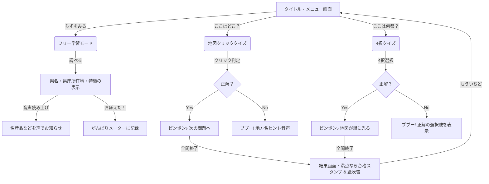

# 🗺️ にほんちずクイズ＆学習アプリへようこそ！

子供たちが日本地図と47都道府県の名前、県庁所在地、そしてそれぞれの魅力を**「見て、聞いて、遊んで」**楽しく覚えられる、プレミアムな知育Webアプリケーションです。

---

## 🎨 本アプリの魅力とこだわり機能

### 1. ３つの楽しいモード
*   **🔍 ちずをみる（フリー学習モード）**
    *   地図上の都道府県を自由にクリックして、名前（ふりがな付き）、県庁所在地、そしてその土地の**「特産品や面白い特徴（子供向け）」**を調べることができます。
    *   「おぼえた！」チェックボタンがあり、自分で学習の進捗を記録できます。
*   **🎯 「ここはどこ？」クイズ**
    *   「『岩手県（いわてけん）』はどこかな？」というお題が出され、正しい場所を地図から探してクリックするゲームです。
    *   間違えても「どの地方にあるか」の音声ヒントが出るため、あきらめずに学習を続けられます。
*   **❓ 「ここは何県？」クイズ**
    *   地図上の一つの県がピカピカとハイライトされます。
    *   サイドバーに表示される4つの選択肢（ふりがな付き）から、正しい県名を選んで答えるゲームです。

### 2. プレミアムな演出とアクセシビリティ
*   **🗣️ 優しく喋る「よみあげ機能」 (Web Speech API)**
    *   お題が出された時や、県をクリックした時に、デバイスが優しく可愛い声で日本語の県名と解説を読み上げます。まだ文字を読めない小さなお子様でも、耳から楽しく覚えられます。
*   **🔊 リアルタイム効果音 (Web Audio API)**
    *   正解した時の「ピコポロロン♪（上昇音）」や、間違えた時の「ブブー（ブザー）」、クリア時の「ファンファーレ」を、外部音声ファイルを使わずにブラウザ内部でリアルタイムに合成・再生します。
*   **✨ かんたん「ふりがな（ルビ）」ON / OFF**
    *   ワンクリックで、すべての漢字の隣に「ふりがな」を表示するか、漢字だけにするかを切り替えられます。小学校低学年から高学年、保護者の方まで幅広く対応します。
*   **🎉 はなやかな「紙吹雪（かみふぶき）」でお祝い**
    *   クイズを満点でクリアすると、画面いっぱいにカラフルな紙吹雪が舞い散る美しいアニメーションが作動します！
*   **🏆 合格メダル（スタンプ）キャビネット**
    *   各地方のクイズを全問正解でクリアすると、メニュー画面のキャビネットに可愛い「合格メダルスタンプ（👑⭐🌸🏮🌳🍊🌺）」が飾られていきます。LocalStorageに保存されるため、ブラウザを閉じても頑張った記録は消えません！

---

## 🗺️ 画面遷移とアプリの構造



---

## 🚀 アプリの起動方法

このアプリは完全に単一のフォルダ内で完結するSPA（シングルページアプリケーション）ですので、外部インターネット接続や難しいサーバー設定は不要です。

### 最も簡単な方法（ダブルクリック）
1. 作成されたフォルダ `japan-map-quiz` に移動します。
2. `index.html` ファイルを、普段お使いのウェブブラウザ（Google Chrome, Microsoft Edge, Safariなど）にドラッグ＆ドロップするか、ダブルクリックで開きます。
3. すぐに綺麗な日本地図とメニュー画面が表示され、遊ぶことができます！

### ローカル開発サーバーを起動する場合（推奨）
音声読み上げ機能（Web Speech API）や効果音の一部ブラウザ制限を完全に解除し、最高のパフォーマンスで動作させるために、ローカルサーバー経由で開くことをお勧めします。

PowerShellなどのターミナルで、プロジェクトのフォルダに移動して以下のいずれかのコマンドを実行します。

**Pythonを使う場合（最も手軽）:**
```bash
python -m http.server 8000
```
起動後、ブラウザで `http://localhost:8000` にアクセスしてください。

**Node.js (npm) を使う場合:**
```bash
npx http-server -p 8000
```
起動後、ブラウザで `http://localhost:8000` にアクセスしてください。

---

## 📂 作成されたファイルの一覧

*   **index.html**: 
    *   アプリの骨組みとなるHTMLです。Geolonia製のレスポンシブ対応日本地図SVGをインラインで埋め込んでおり、高速かつ美麗に動作します。
*   **style.css**: 
    *   パステルカラーを基調とした、子供向けの可愛くプレミアム感あふれるガラスモーフィズムデザインを定義しています。ホバーや正解・不正解時のアニメーションを制御します。
*   **app.js**: 
    *   47都道府県の全データ、Web Audio APIによる効果音合成、Web Speech APIによる音声読み上げ、クイズのゲームロジック、紙吹雪パーティクルシステム、LocalStorage保存処理をすべて備えたメインプログラムです。

たくさん遊んで、すべての地方の「合格メダル」を集めてみてくださいね！🏅
